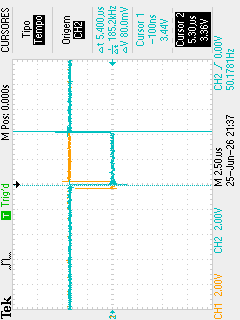
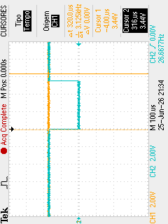
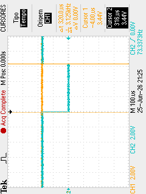
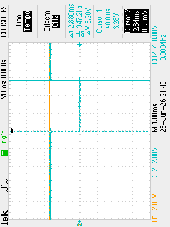

| Tested Targets | ESP32-S3 |
| ----------------- | ----- | -------- | -------- | -------- | -------- | -------- | -------- | -------- | -------- |

# Tarefa 3 - MCC2

## Medições de WCET (osciloscópio)

*WCET do ir_line task*

*WCET do speed_ctrl task*

*WCET do wheel task*

*WCET do treeeyes task*

Tempo 