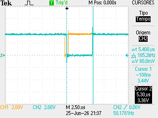
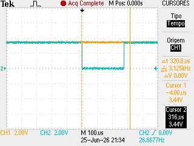
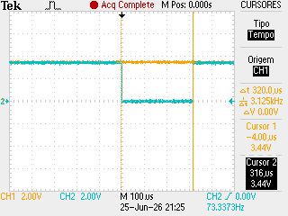
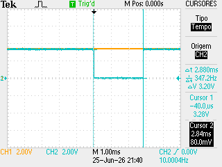
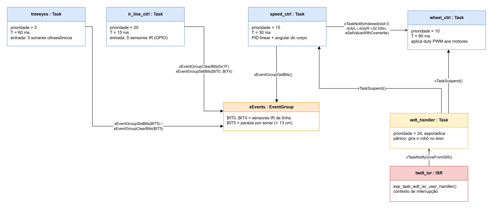

| Tested Targets | ESP32-S3 |

# Tarefa 3 - MCC2

## Descrição das tarefas

- **ir_line** (`ir_line_ctrl`) — lê os 5 sensores infravermelhos de linha por GPIO (o sensor dá 0 quando a linha é detectada) e publica o estado nos bits 0..4 do event group `xEvents`.

- **speed_ctrl** (`speed_ctrl`) — o controlador central: lê os bits do `xEvents`, converte o padrão dos sensores num estado exclusivo da linha (com posições intermediárias), gera o setpoint de velocidade linear/angular do corpo, estima a velocidade real pelos encoders, executa dois PIDs (linear e angular), aplica a cinemática inversa e envia o duty de cada roda ao `wheel` via task notification. Se o BIT5 (parada por sonar) estiver ativo, congela o PID e comanda duty 0. Também emite telemetria pela UART para a GUI Python.

- **wheel** (`wheel_ctrl`) — atuador: recebe por task notification o duty empacotado (16 bits por roda, offset +1024 para transmitir o sinal), satura em ±400 ticks, define o sentido de rotação de cada roda e aplica o PWM (MCPWM). Sem notificação nova, reaplica o último comando.

- **treeeyes** (`Treeeyes`) — dispara os 3 sonares ultrassônicos HC-SR04, escolhe o objeto mais próximo e converte o tempo de voo em distância. Abaixo de 10 cm levanta o BIT5 do `xEvents` (parada de emergência); o flag só é derrubado após 6 leituras consecutivas acima do limiar, para filtrar falsos positivos.

- **wdt_handler** (`wdt_handler`) — tratador do Task Watchdog Timer: fica bloqueado em `ulTaskNotifyTake` até a ISR do TWDT notificar (a ISR não faz trabalho pesado). Ao acordar, suspende `speed_ctrl` e `wheel` e coloca o robô girando em torno do próprio eixo — estado de pânico visível indicando que alguma tarefa travou.

## Medições de WCET (osciloscópio)

WCET medido do ir_line task - 5.3uS

WCET medido do speed_ctrl task - 280uS

WCET medido do wheel task- 316uS

WCET medido do treeeyes task - 2.84mS

## Análise de escalonabilidade (RMA)

U = Σ (Cᵢ / Tᵢ) ≤ n·(2^(1/n) − 1)

| Task       | C (WCET)* | T (período) | C/T     |
|------------|-----------|-------------|---------|
| ir_line    | 6.36 µs   | 15 ms       | 0.04 %  |
| speed_ctrl | 336 µs    | 30 ms       | 1.12 %  |
| wheel      | 379 µs    | 60 ms       | 0.63 %  |
| treeeyes   | 3.41 ms   | 60 ms       | 5.68 %  |
| **Total**  |           |             | **U ≈ 7.5 %** |

\* Aos valores de WCET medidos no osciloscópio foi adicionada uma margem de segurança de 20%, pois o máximo observado não é o WCET garantido

Como U ≈ 7.5 % é muito menor que o limite de Liu & Layland para n=4 (75.7 %), o sistema é escalonável com grande folga.

## Prioridades de execução (do maior para o menor):
1. ir_line 
2. speed_ctrl
3. wheel
4. treeeyes

## Escolha dos períodos de ativação

O período-base do sistema é o do `speed_ctrl` (**30 ms**), escolhido empiricamente como a frequência ótima de funcionamento do PID de velocidade do corpo. Os períodos das demais tarefas foram derivados dele:

- **ir_line — 15 ms** (2× a frequência do PID): garante que a cada ciclo do `speed_ctrl` haja sempre uma leitura fresca dos sensores de linha no event group.
- **wheel — 60 ms** (metade da frequência do PID): garante que o PID sempre termine de calcular e enviar um comando novo antes de o `wheel` aplicar o PWM; assim o `wheel` nunca reaplica um duty desatualizado.
- **treeeyes — 60 ms**: o fabricante do HC-SR04 especifica um ciclo mínimo de medição de ~59 ms (para o eco da medição anterior se dissipar e não causar leituras falsas); o valor foi arredondado para 60 ms.

Observação: o conjunto resultante {15, 30, 60, 60} é **harmônico** (cada período divide o seguinte). Para conjuntos harmônicos o limite de utilização do RMS sobe de 75.7 % para 100 %, e as fases entre as tarefas se repetem a cada hiperperíodo de 60 ms — o jitter de comunicação entre elas fica determinístico.

## Diagrama UML de comunicação entre as tasks 

- `ir_line_ctrl` e `treeeyes` são os **produtores**: escrevem o estado dos sensores no event group `xEvents`.
- `speed_ctrl` é o **consumidor** do `xEvents`: lê os bits, calcula o PID e envia o comando de duty ao `wheel_ctrl` via task notification (valor de 32 bits: 16 bits por roda, com offset +1024 para transmitir o sinal).
- `wheel_ctrl` faz poll da notificação com timeout 0 (mantém-se estritamente periódico); sem notificação nova, reaplica o último comando.
- A ISR do TWDT apenas **notifica** o `wdt_handler` (trabalho pesado não é permitido em ISR); o handler suspende `speed_ctrl`/`wheel_ctrl` e gira o robô em torno do próprio eixo.
